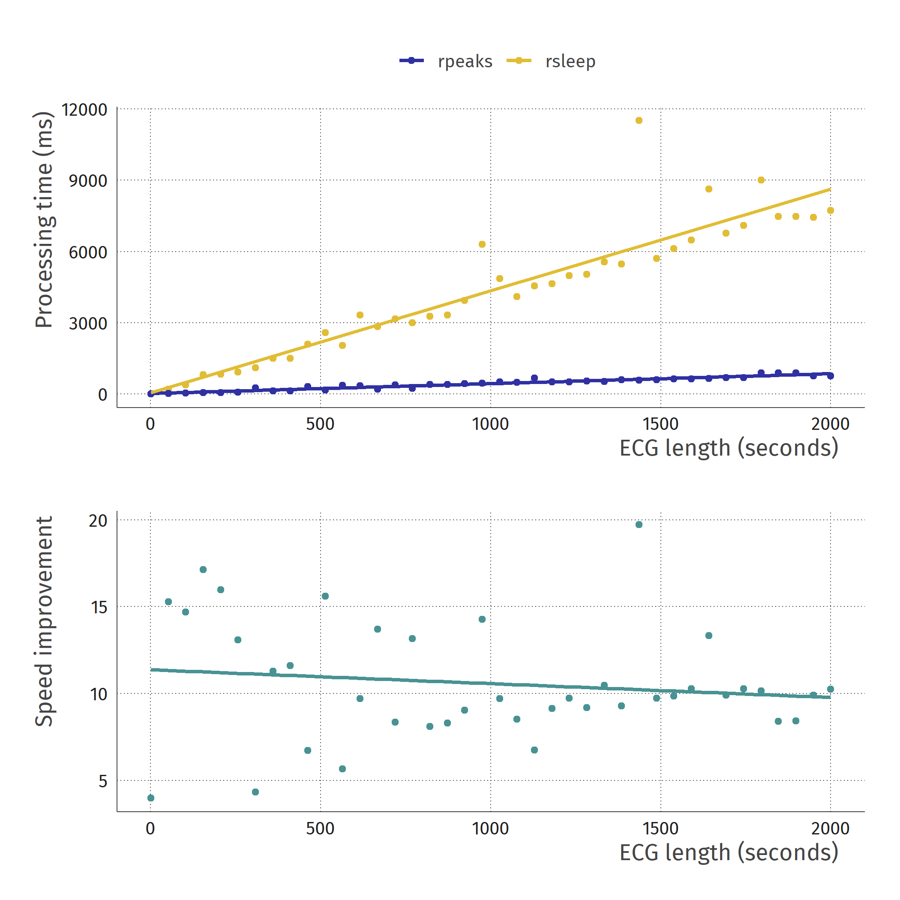

  </img>

Fast implementation of Pan & Tompkins (1985). It is programmed relatively efficiently, using `Rcpp` and `RcppArmadillo` to process long ecg data much faster than alternatives. Default processing parameters are taken directly from the original paper.

This package gratefully borrows parts of the processing code from `rsleep::detect_rpeaks()`.

_NB: use at your own risk. This method has not been officially validated!_

## Speed comparison

  </img>

## Details
This algorithm uses a butterworth filter of order 1 for the band-pass step, and a 3rd-order length-5 Savitzky-Golay smoothing filter to compute the derivative of the band-passed signal. Peak detection on the preprocessed signal works in a simplified way: we take the first value above the lower bound (3 * the mean signal value) which is higher than its  neighbours, and not within the refractory period after the previous R peak.

### Reference
Pan, J., & Tompkins, W. J. (1985). A real-time QRS detection algorithm. _IEEE transactions on biomedical engineering, (3)_, 230-236.
