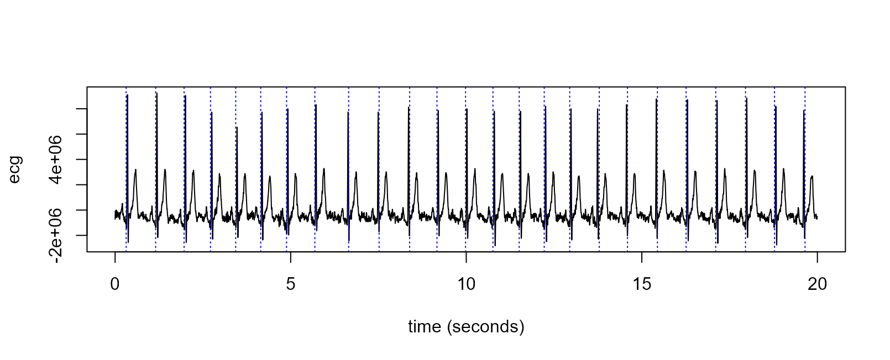

<p align="center">
  </img>
</p>

[](https://github.com/vankesteren/rpeaks/actions/workflows/rcmdcheck.yml)

Fast implementation of Pan & Tompkins (1985). It is programmed relatively efficiently, using `Rcpp` and `RcppArmadillo` to process long ecg data much faster than alternatives. Default processing parameters are taken directly from the original paper.

This package gratefully borrows parts of the processing code from `rsleep::detect_rpeaks()`.

_NB: use at your own risk. This method has not been officially validated!_

## Installation

Install `rpeaks` from `r-universe` like so:
```r
install.packages("rpeaks", repos = c("https://vankesteren.r-universe.dev", "https://cloud.r-project.org"))
```

## Usage

```r
library(rpeaks)
ecg_url <- "https://physionet.org/files/ecgiddb/1.0.0/Person_01/rec_2.dat?download"
ecg_dat <- readBin(ecg_url, integer(), 500*30)
ecg_sec <- (0:(length(ecg_dat) - 1)) / 500 # rel. time in seconds
r_peaks <- rpeaks_pan_tompkins(ecg = ecg_dat, sample_rate = 500)
plot(x = ecg_sec, y = ecg_dat, type = "l", xlab = "time (seconds)", ylab = "ecg")
abline(v = r_peaks, col = "blue", lty = 3)
```
<p align="center">
  </img>
</p>


## Speed comparison

The package achieves a nice speedup relative to the `rsleep` implementation:

<p align="center">
  </img>
</p>

## Details
This algorithm uses a butterworth filter of order 1 for the band-pass step, and a 3rd-order length-5 Savitzky-Golay smoothing filter to compute the derivative of the band-passed signal. Peak detection on the preprocessed signal works in a simplified way: we take the first value above the lower bound (3 * the mean signal value) which is higher than its  neighbours, and not within the refractory period after the previous R peak.


### Reference
Pan, J., & Tompkins, W. J. (1985). A real-time QRS detection algorithm. _IEEE transactions on biomedical engineering, (3)_, 230-236.
